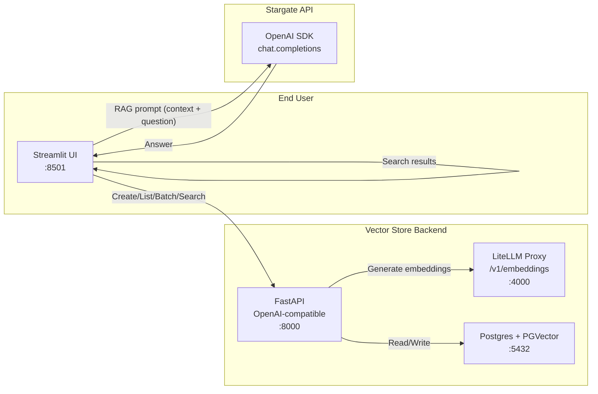
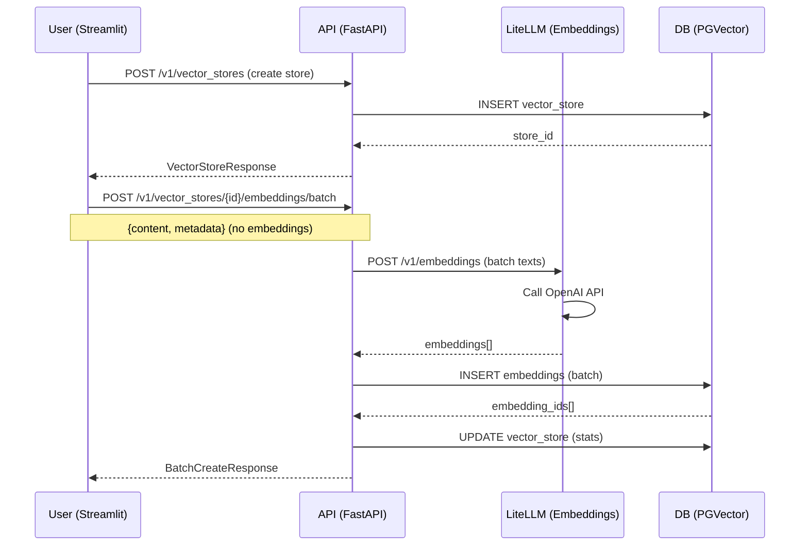
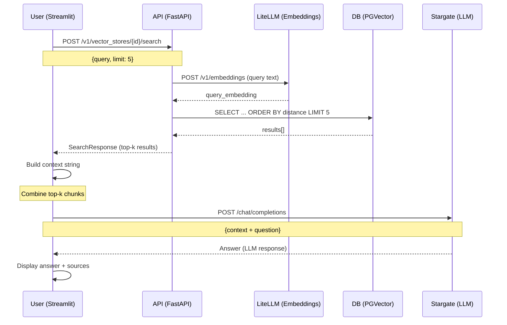

# PolicyVector AI - Architecture Documentation

## 📋 Table of Contents

1. [Overview](#overview)
2. [High-Level Architecture](#high-level-architecture)
3. [Component Details](#component-details)
4. [Data Flow](#data-flow)
5. [Deployment Topology](#deployment-topology)
6. [Security & Configuration](#security--configuration)
7. [Sequence Diagrams](#sequence-diagrams)
8. [Optional Extensions](#optional-extensions)

---

## Overview

This document describes the architecture of an AI-powered Policy Q&A system that enables semantic search and question-answering over company policy documents using Retrieval-Augmented Generation (RAG).

### Core Capabilities

- **Semantic Search**: Find policies by meaning, not just keywords
- **Vector Storage**: Efficient storage and retrieval using PGVector
- **RAG Answers**: Generate answers grounded in policy documents using Stargate LLM
- **Multiple Ingest Methods**: Paste text, upload files, or fetch from MCP servers
- **OpenAI-Compatible API**: Standardized endpoints for easy integration

---

## High-Level Architecture

### ASCII Diagram

```
+-----------------------------------------------+
|                  End User                     |
|  (Browser)                                    |
|   └──> Streamlit UI (http://localhost:8501)   |
+-----------------------------------------------+
                |          ^
                |          | RAG Answer (Stargate LLM)
  Manage Stores |          |
  Ingest/Search |          |
                v          |
+-----------------------------------------------+
|        Vector Store API (FastAPI)             |
|  (http://localhost:8000)                      |
|  OpenAI-compatible endpoints:                 |
|   - POST /v1/vector_stores                    |
|   - POST /v1/vector_stores/{id}/embeddings    |
|   - POST /v1/vector_stores/{id}/search        |
+-----------------------------------------------+
                |         ^
                |         | embeddings (LiteLLM /v1/embeddings)
                v         |
+-----------------------------------------------+
|          LiteLLM Proxy (Embeddings)           |
|   (http://localhost:4000)                     |
|   entrypoint: litellm                         |
|   model: text-embedding-ada-002               |
|   uses: EMBEDDING__API_KEY                    |
+-----------------------------------------------+
                |
                | SQL (asyncpg/psycopg2)
                v
+-----------------------------------------------+
|           Postgres + PGVector (DB)            |
|   (localhost:5432, docker service 'db')       |
|   Tables:                                     |
|     vector_stores(id,name,metadata,...)       |
|     embeddings(id,vector_store_id,content,   |
|               embedding VECTOR(1536),metadata)|
+-----------------------------------------------+

                    RAG path (LLM inference)
                    +----------------------+
                    |   Stargate API       |
                    | (OpenAI-compatible)  |
                    |  chat.completions    |
                    +----------------------+
                    BASE_URL + API_KEY in .env
```

### Mermaid Diagram



---

## Component Details

### 1. Postgres + PGVector

**Purpose**: Vector database for storing policy embeddings and enabling semantic search.

**Image**: `pgvector/pgvector:pg17`

**Key Features**:
- PGVector extension for vector operations
- Cosine similarity search using `<=>` operator
- IVFFLAT index for fast similarity queries
- GIN index for metadata filtering

**Schema**:
```sql
-- Vector stores table
CREATE TABLE vector_stores (
    id UUID PRIMARY KEY DEFAULT gen_random_uuid(),
    name TEXT NOT NULL,
    file_counts JSONB DEFAULT '{"in_progress": 0, "completed": 0, "failed": 0, "cancelled": 0, "total": 0}',
    status TEXT DEFAULT 'completed',
    usage_bytes BIGINT DEFAULT 0,
    expires_after JSONB,
    expires_at TIMESTAMP,
    last_active_at TIMESTAMP,
    metadata JSONB,
    created_at TIMESTAMP DEFAULT NOW()
);

-- Embeddings table
CREATE TABLE embeddings (
    id UUID PRIMARY KEY DEFAULT gen_random_uuid(),
    vector_store_id UUID REFERENCES vector_stores(id),
    content TEXT NOT NULL,
    embedding VECTOR(1536),  -- Match embedding model dimensions
    metadata JSONB,
    created_at TIMESTAMP DEFAULT NOW()
);

-- Indexes for performance
CREATE INDEX idx_embeddings_vector_store ON embeddings(vector_store_id);
CREATE INDEX idx_embeddings_vector ON embeddings USING ivfflat (embedding vector_cosine_ops);
CREATE INDEX idx_embeddings_metadata ON embeddings USING gin(metadata);
```

**Port**: `5432`

---

### 2. LiteLLM Proxy

**Purpose**: Provides OpenAI-compatible `/v1/embeddings` endpoint for any embedding model.

**Image**: `ghcr.io/berriai/litellm:latest`

**Configuration**:
```yaml
platform: linux/amd64
entrypoint: ["litellm"]
command: ["--model", "text-embedding-ada-002", "--port", "4000"]
environment:
  OPENAI_API_KEY: ${EMBEDDING__API_KEY}
```

**Key Features**:
- Converts any embedding provider to OpenAI-compatible API
- Supports multiple models (OpenAI, Cohere, etc.)
- Decouples application from specific provider

**Port**: `4000`

**Endpoints**:
- `POST /v1/embeddings` - Generate embeddings for text

---

### 3. FastAPI Vector Store API

**Purpose**: Backend service providing OpenAI-compatible vector store endpoints.

**Technology**: FastAPI, Prisma, asyncpg

**Key Features**:
- OpenAI-compatible API specification
- Automatic embedding generation via LiteLLM
- Batch operations for efficient ingestion
- Metadata filtering
- Bearer token authentication

**Port**: `8000`

**Endpoints**:

| Method | Endpoint | Description |
|--------|----------|-------------|
| `POST` | `/v1/vector_stores` | Create a new vector store |
| `GET` | `/v1/vector_stores` | List vector stores (paginated) |
| `POST` | `/v1/vector_stores/{id}/embeddings` | Add single embedding |
| `POST` | `/v1/vector_stores/{id}/embeddings/batch` | Add multiple embeddings |
| `POST` | `/v1/vector_stores/{id}/search` | Semantic search with cosine similarity |
| `GET` | `/health` | Health check endpoint |

**Authentication**: `Authorization: Bearer <API_KEY>`

---

### 4. Streamlit UI

**Purpose**: User-friendly interface for managing policies and asking questions.

**Technology**: Streamlit, OpenAI SDK, httpx

**Port**: `8501`

**Tabs**:

1. **Stores**
   - List existing vector stores
   - Create new vector stores
   - View store metadata

2. **Ingest**
   - **Paste Text**: Direct text input with chunking options
   - **Upload File**: Support for TXT, PDF, DOCX files
   - **MCP Fetch**: Fetch policies from MCP server
   - Automatic chunking with configurable size and overlap
   - Metadata tagging

3. **Search**
   - Semantic search interface
   - Configurable result limit
   - Display similarity scores
   - Show metadata and content chunks

4. **RAG Chat**
   - Interactive chat interface
   - Combines search results into context
   - Sends to Stargate LLM for answer generation
   - Displays sources and citations

**Features**:
- Real-time progress indicators
- Error handling and user feedback
- Responsive layout
- Session state management

---

### 5. Stargate API

**Purpose**: LLM provider for generating RAG answers.

**Integration**: OpenAI SDK compatible

**Configuration**:
- `STARGATE_API_KEY`: Authentication key
- `STARGATE_BASE_URL`: API endpoint URL
- `STARGATE_MODEL`: Model name (e.g., `gptoss-20b`)

**Usage**:
- Receives context (top-k policy chunks) + user question
- Generates answer grounded in provided context
- Returns formatted response

**Example Request**:
```python
response = stargate_client.chat.completions.create(
    model=STARGATE_MODEL,
    messages=[
        {"role": "system", "content": "You are a helpful assistant..."},
        {"role": "user", "content": f"Context: {context}\n\nQuestion: {question}"}
    ],
    temperature=0.7,
    max_tokens=1000
)
```

---

## Data Flow

### Ingestion Path

```
User (Streamlit UI)
  ↓
1. Select/Create Vector Store
  ↓
2. Choose Ingest Method:
   - Paste Text
   - Upload File (PDF/DOCX/TXT)
   - MCP Fetch
  ↓
3. Chunk Text (configurable size/overlap)
  ↓
4. POST /v1/vector_stores/{id}/embeddings/batch
   (content + metadata)
  ↓
FastAPI Backend
  ↓
5. Generate Embeddings (if not provided)
   POST http://litellm:4000/v1/embeddings
  ↓
LiteLLM Proxy
  ↓
6. Call Embedding Provider API
   (OpenAI, Cohere, etc.)
  ↓
7. Store in PGVector
   INSERT INTO embeddings (content, embedding, metadata)
  ↓
8. Update Vector Store Statistics
   (file_counts, usage_bytes)
```

### Search Path

```
User (Streamlit UI)
  ↓
1. Enter Search Query
  ↓
2. POST /v1/vector_stores/{id}/search
   {query, limit, filters}
  ↓
FastAPI Backend
  ↓
3. Generate Query Embedding
   POST http://litellm:4000/v1/embeddings
  ↓
4. Vector Similarity Search
   SELECT ... FROM embeddings
   WHERE vector_store_id = ?
   ORDER BY embedding <=> query_vector
   LIMIT ?
  ↓
5. Convert Distance to Similarity Score
   score = 1 - (distance / 2)
  ↓
6. Return Results
   {data: [{file_id, filename, score, content, metadata}]}
  ↓
Streamlit UI
  ↓
7. Display Results with Scores
```

### RAG Answer Path

```
User (Streamlit UI)
  ↓
1. Enter Question in Chat
  ↓
2. Search for Relevant Policies
   POST /v1/vector_stores/{id}/search
   (query = question, limit = top_k)
  ↓
3. Build Context String
   Combine top-k policy chunks
   Format: "[Score: X] {chunk_text}\n\n..."
  ↓
4. Generate RAG Answer
   POST Stargate API /chat/completions
   {
     model: "gptoss-20b",
     messages: [
       {role: "system", content: "You are..."},
       {role: "user", content: "Context: {context}\n\nQuestion: {question}"}
     ]
   }
  ↓
Stargate API
  ↓
5. Generate Answer
   (LLM inference with context)
  ↓
6. Return Answer
  ↓
Streamlit UI
  ↓
7. Display Answer + Sources
   - Show answer in chat
   - Expandable sources section
   - Metadata and scores
```

---

## Deployment Topology

### Docker Compose Stack

```yaml
services:
  db:          # Postgres + PGVector
    image: pgvector/pgvector:pg17
    platform: linux/amd64
    ports: ["5432:5432"]
    
  litellm:    # Embedding Proxy
    image: ghcr.io/berriai/litellm:latest
    platform: linux/amd64
    ports: ["4000:4000"]
    
  api:        # FastAPI Backend
    build: .
    dockerfile: Dockerfile
    ports: ["8000:8000"]
    depends_on:
      - db
      - litellm
    
  ui:         # Streamlit UI
    build: .
    dockerfile: Dockerfile.ui
    ports: ["8501:8501"]
    depends_on:
      - api
```

### Network Architecture

- **Network**: `vectordb-network` (bridge)
- **Internal Communication**: Service names (e.g., `http://api:8000`)
- **External Access**: `localhost` ports

### Service Dependencies

```
db (Postgres)
  ↑
  ├── litellm (depends on db health)
  │
  └── api (depends on db + litellm health)
       ↑
       └── ui (depends on api health)
```

### Volumes

- `postgres_data`: Persistent storage for database
- `./prisma`: Prisma schema (mounted in API container)

---

## Security & Configuration

### Environment Variables

#### Database
```env
DATABASE_URL=postgresql://postgres:postgres@db:5432/vectordb?schema=public
```

#### Vector Store API
```env
OPENAI_API_KEY=sk-local-xyz  # Client authentication token
SERVER_API_KEY=sk-local-xyz   # Alternative name (backward compatibility)
```

#### LiteLLM Proxy
```env
EMBEDDING__MODEL=text-embedding-ada-002
EMBEDDING__BASE_URL=http://litellm:4000
EMBEDDING__API_KEY=sk-your-real-openai-key  # Provider API key
EMBEDDING__DIMENSIONS=1536
```

#### Streamlit UI
```env
STREAMLIT__API_BASE=http://api:8000        # Docker: use service name
STREAMLIT__API_BASE=http://localhost:8000  # Local: use localhost
STREAMLIT__API_KEY=sk-local-xyz
STREAMLIT__EMBED_BASE=http://litellm:4000
STREAMLIT__EMBED_MODEL=text-embedding-ada-002
```

#### MCP Server (Optional)
```env
MCP__BASE_URL=http://localhost:7070
MCP__SEARCH_TOOL=policy_search
MCP__FETCH_TOOL=policy_fetch
```

#### Stargate LLM
```env
STARGATE_API_KEY=your-stargate-key
STARGATE_BASE_URL=https://your-stargate-host/api
STARGATE_MODEL=gptoss-20b
```

### Security Considerations

1. **API Authentication**: Bearer token required for all API endpoints
2. **Environment Variables**: Never commit `.env` file (use `.env.example`)
3. **Database Credentials**: Use strong passwords in production
4. **Network Isolation**: Services communicate via internal Docker network
5. **HTTPS**: Use reverse proxy (nginx/traefik) for production HTTPS

---

## Sequence Diagrams

### Complete Ingestion Flow



### Search & RAG Flow



---

## Optional Extensions

### 1. MCP Integration

**Purpose**: Fetch policies from external MCP servers.

**Implementation**:
- Search tool: `POST /search` → returns policy IDs
- Fetch tool: `POST /fetch` → returns policy content
- Authentication: Headers/tokens as needed

**Example**:
```python
def mcp_search(query: str) -> List[Dict]:
    response = httpx.post(
        f"{MCP_BASE_URL}/search",
        json={"query": query, "tool": MCP_SEARCH_TOOL},
        headers={"Authorization": f"Bearer {MCP_TOKEN}"}
    )
    return response.json()["results"]
```

### 2. Performance Optimizations

**IVFFLAT Index**:
```sql
CREATE INDEX idx_embeddings_vector 
ON embeddings 
USING ivfflat (embedding vector_cosine_ops)
WITH (lists = 100);  -- Adjust based on data size
```

**Connection Pooling**:
- Use asyncpg connection pool
- Configure max_connections in settings

**Batch Operations**:
- Use batch endpoints for bulk ingestion
- Process embeddings in parallel

### 3. Observability

**Health Endpoints**:
- `/health` - API health check
- Database connection status
- LiteLLM proxy availability

**Logging**:
- Structured logging with correlation IDs
- Request/response logging
- Error tracking

**Monitoring**:
- Prometheus metrics
- Grafana dashboards
- Alerting on errors

### 4. Advanced Features

**Streaming Chat**:
- Token streaming from Stargate
- Real-time answer display
- Better UX for long responses

**Metadata Filtering**:
- Advanced filter queries
- Category-based search
- Date range filters

**Multi-tenancy**:
- Tenant isolation
- Per-tenant vector stores
- Access control

---

## Summary

This architecture provides a complete, production-ready Policy Q&A system with:

✅ **Semantic Search** via PGVector  
✅ **OpenAI-Compatible API** for easy integration  
✅ **User-Friendly UI** with Streamlit  
✅ **RAG Answers** using Stargate LLM  
✅ **Multiple Ingest Methods** (paste, upload, MCP)  
✅ **Docker Deployment** for easy setup  
✅ **Scalable Design** with async operations  

The system is designed to be:
- **Modular**: Each component has a clear responsibility
- **Extensible**: Easy to add new features
- **Maintainable**: Well-documented and structured
- **Production-Ready**: Includes error handling, logging, and health checks
